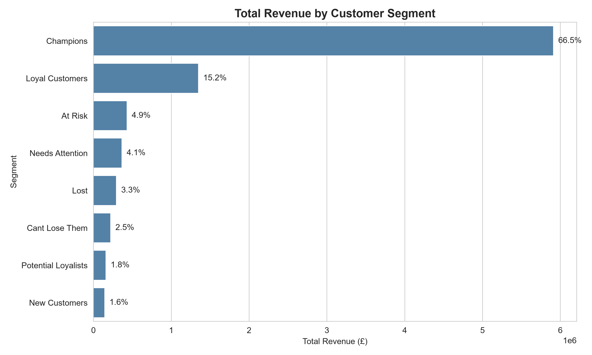
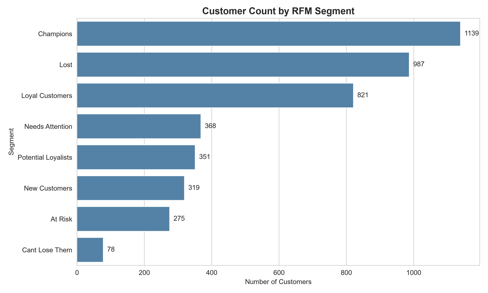

# Automated Customer Segmentation (RFM) Analytics Engine

An end-to-end Python pipeline that segments e-commerce customers using the **RFM (Recency, Frequency, Monetary)** framework — a foundational technique in marketing analytics and CRM strategy.

## 📊 Key Finding

**"Champions" represent ~26% of the customer base but generate 66.5% of total revenue.**

This insight directly informs retention strategy: protecting and rewarding this segment should be a top priority, while "At Risk" and "Cant Lose Them" segments represent high-value win-back opportunities.



## 🎯 Business Objective

Identify high-value customer segments to enable targeted marketing strategies:
- **Reward and retain** top spenders ("Champions")
- **Re-engage** customers showing signs of churn ("At Risk", "Cant Lose Them")
- **Nurture** emerging customers into loyal, repeat buyers ("Potential Loyalists", "New Customers")

## 📁 Dataset

- **Source**: [UCI Machine Learning Repository — Online Retail Dataset](https://archive.ics.uci.edu/dataset/352/online+retail)
- ~540,000 transaction records from a UK-based online retailer (Dec 2010 – Dec 2011)

## 🔧 Methodology

1. **Data Cleaning**: Removed missing CustomerIDs, cancellations/returns, and duplicate entries
2. **RFM Calculation**: Computed Recency, Frequency, and Monetary value for each of 4,338 unique customers
3. **Scoring**: Assigned 1–5 quintile scores across each RFM dimension
4. **Segmentation**: Mapped score combinations to actionable business segments (Champions, Loyal Customers, At Risk, etc.)
5. **Visualization**: Analyzed segment size and revenue contribution



## 🛠️ Tech Stack

- Python, pandas, numpy
- matplotlib, seaborn (visualization)
- Jupyter Notebook

## 🚀 How to Run

```bash
# Clone the repository
git clone https://github.com/Soham006/rfm-customer-segmentation.git
cd rfm-customer-segmentation

# Create a virtual environment
python -m venv venv
venv\Scripts\activate   # Windows
source venv/bin/activate  # Mac/Linux

# Install dependencies
pip install -r requirements.txt

# Open the notebook
jupyter notebook 01_data_exploration.ipynb
```

The pipeline is parameterized — to use a different dataset, simply update the configuration cell at the top of the notebook (file name and column mappings).

## 📈 Output

The notebook generates `rfm_segmentation_output.csv` — a customer-level dataset with RFM scores and segment labels, ready for use in CRM tools, dashboards, or further analysis.

## 👤 About

Built by **Soham Roy**, MBA candidate (Marketing & Analytics) at IMI Kolkata, with a B.Tech in Computer Science — combining a marketing strategy lens with hands-on data analytics implementation.
